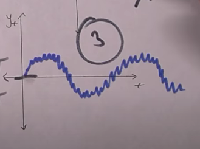

It can tell us can we use the AR(Autoregressive) model or MA(Moving Average) model

The condition need to be met if a time series is stationary:
- Mean is constant
- Std is constant
- No seasonality

Example 1:

- The mean is constant
- There's no seasonality (no periodic overtime that's predictable)
- But the standard deviation is not constant as we can see the volatility at the start, very high but it lower as the time goes meaning the std is not constant.

Example 2:
![[Pasted image 20240520161918.png]]
- The standard deviation is constant
- No seasonality
- But the issue is mean is changing

Example 3:
![[Pasted image 20240520162037.png]]
- Std and mean constant
- Seasonality there's

That means all of these three are not stationary

## White Noise VS Stationary
If its white noise then it is stationary but
if its stationary doesn't mean it's white noise

How do we check stationary:
1. Visually
2. Global vs local test, basically comparing the whole to the sample.
3. Augmented Dickey-Fuller (ADF test)

## Turning non stationary to Stationary
Suppose you have a linear looking function:
$y_t$=$\beta_0$+$\beta_0$$t$+$\varepsilon t$

The first beta and second is basically the slope function, and with some noise from the constant.

